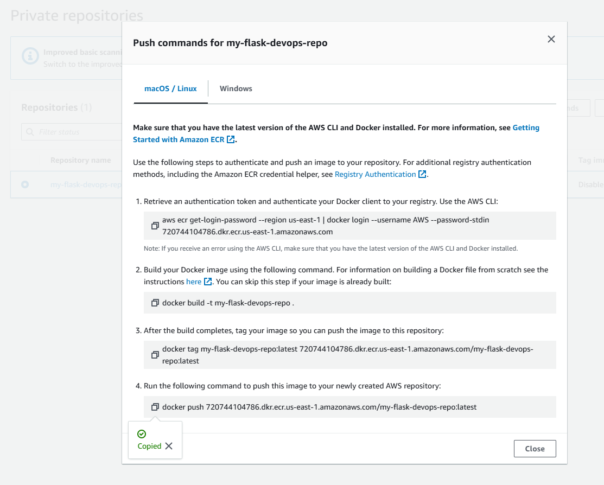
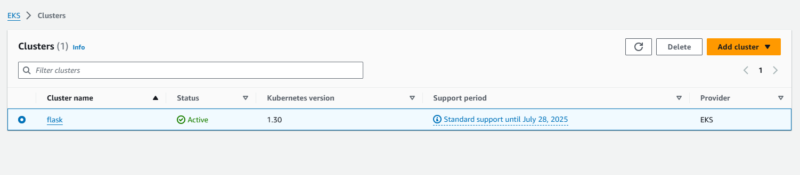
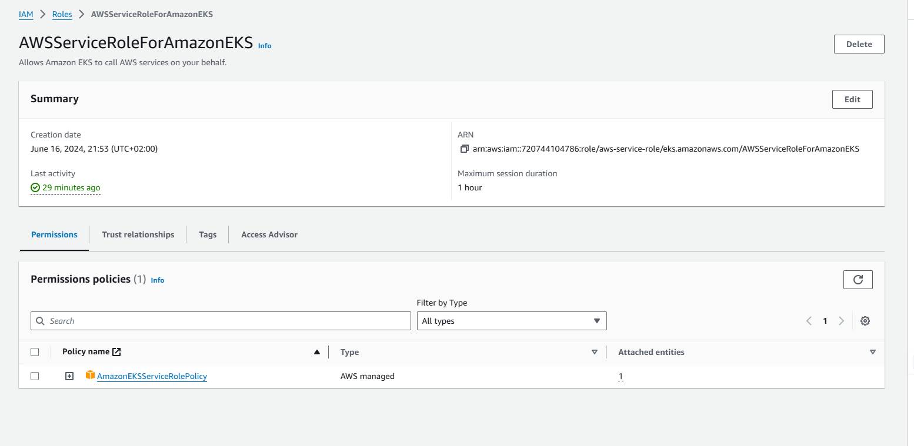
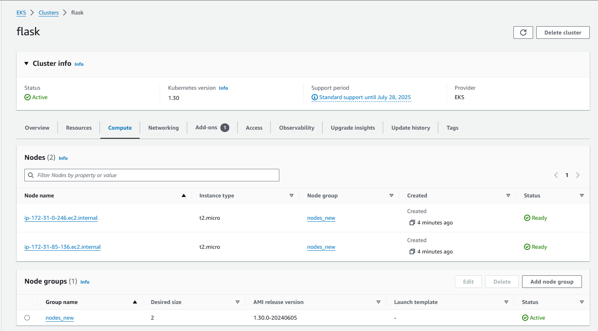
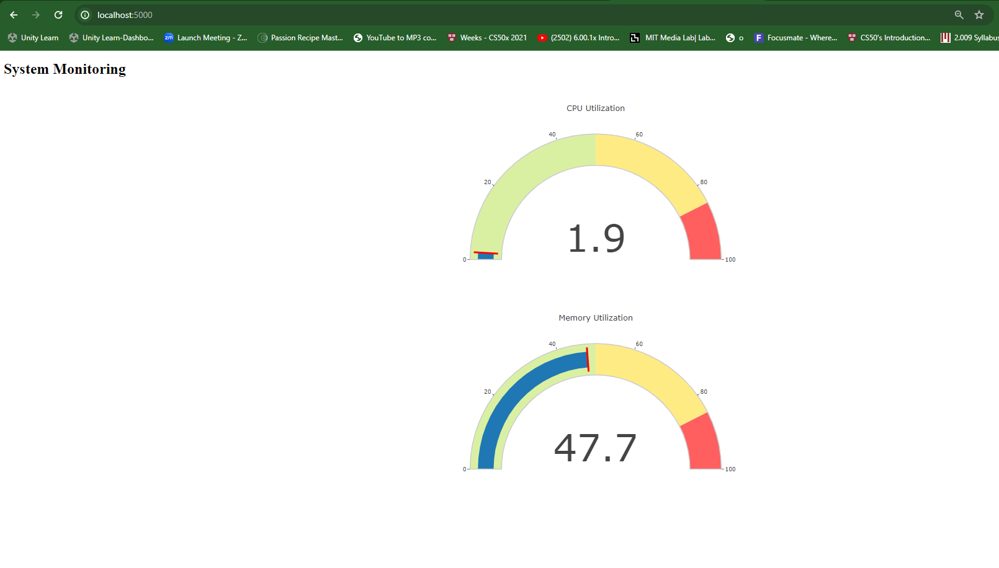

# DevOps with Docker & Kubernetes

In this project a web-application has been deployed to cloud (AWS) using Docker and Kubernetes. AWS provides robust support and integration for Docker and Kubernetes, including services like Amazon ECR (Elastic Container Registry) for managing Docker images and Amazon EKS for managing Kubernetes clusters. Docker ensures that our application runs the same way regardless of where it is deployed. This eliminates environment-related issues and simplifies development and testing. Kubernetes provides automated scaling of our application based on demand. We can easily scale your application up or down to handle traffic spikes or reduce costs during low-traffic periods. It also provides self-healing capabilities. If a container or pod fails, Kubernetes automatically reschedules and replaces it, ensuring high availability.

The following steps were taken to deploy the web application to cloud:

- Created a flask app for monitoring local resources like memory and CPU. The app shows the memory and cpu usage using gauge indicators.

- Created a Docker image for this flask app.

- Pushed the docker image to a repository in AWS ECR (Elastic Container Registry) using the URi of the ECR repository
  

- Used the boto3 (AWS SDK Client) to interact with AWS through api calls.

- Created a Kubernetes cluster. We created and selected a security group with access to the Kubernetes cluster.
  

- Once the cluster was up and ready, a node group was created with 2 nodes. We created an attached IAM role with corresponding policies for the Node group.

- Since the app is a very lightweight application , t2.micro instances from AWS were used to create nodes.

- Created Kubernetes deployment (using our container image URi in the ECR repo) to deploy our application with the desired number of replicas. Then a kubernetes service was created to expose the application.

- Once the kubernetes pod was up and running we port forwarded the service to port 5000 of the local machine to run it locally as well.

## App Screenshot

